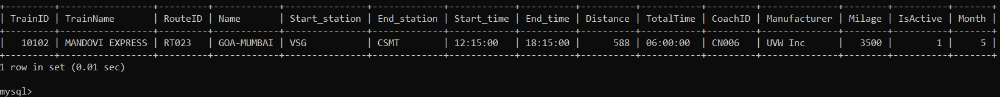
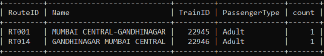
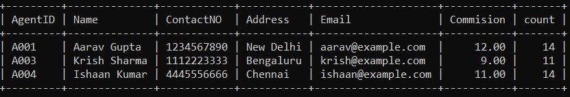
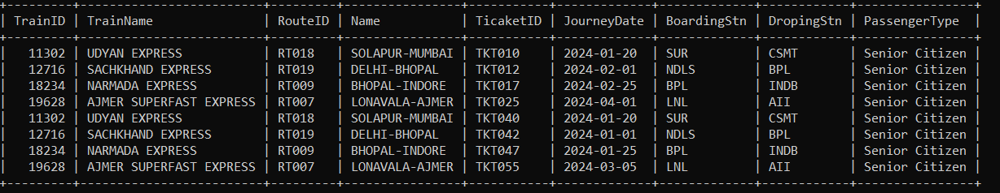
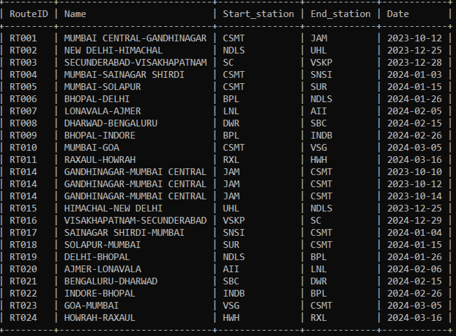

# Set - A
### 1.	Show all trains information travelling between Goa Mumbai and Ajmer-Lonavala where at least half the coaches are due for maintenance on or before 30 November this year.

```sql
SELECT T.TrainID, T.TrainName, R.*, C.CoachID, C.Manufacturer, C.Milage, C.IsActive, month(C.LmDate) as Month from coaches C, trains T, routes R
 WHERE C.TrainID = T.TrainID AND R.RouteID = T.RouteID AND R.Name IN("GOA-MUMBAI","AJMER-LONAVALA")
 having Month<6;
```

## OUTPUT


<hr>

### 2.	List all the routes in descending order of seats sold, including route information and distribution of seats sold (Children, Adult, Senior Citizen) in the month of October this year.

```sql
SELECT R.RouteID, R.Name,der.* FROM Routes R, Trains T,
 (SELECT TrainID, PassengerType, COUNT(TicaketID) AS count FROM Tickets
 WHERE month(BookingDate) = 10
 GROUP BY TrainID, PassengerType
 ORDER BY(count) desc) der
 WHERE der.TrainID=T.TrainID AND T.RouteID=R.RouteID;
```

## OUTPUT


<hr>


### 3.	List all agents’ information with more than 10 confirmed bookings in the month of September this year.

```sql
SELECT A.* , BK.count from Agents A,
(SELECT AgentID, COUNT(TicaketID) AS count FROM Tickets
WHERE AgentID IS NOT NULL AND TicketStatus = "confirmed"
GROUP BY AgentID
HAVING count>10) BK 
WHERE BK.AgentID=A.AgentID;
```

## OUTPUT


<hr>


### 4.	Display the details of the route most travelled by Senior Citizens.

```sql
SELECT T.TrainID, T.TrainName,R.RouteID, R.Name, TK.TicaketID, TK.JourneyDate, TK.BoardingStn, TK.DropingStn, TK.PassengerType FROM Trains T
INNER JOIN Routes R ON R.RouteID = T.RouteID
INNER JOIN Tickets TK ON TK.TrainID = T.TrainID
WHERE TK.PassengerType = "Senior Citizen";
```

## OUTPUT


<hr>


### 5.	Display the details of the route where a train was always on time.

```sql
SELECT R.RouteID, R.Name, R.Start_station, R.End_station, TS.Date
 FROM Routes R, TrainSchedule TS
 WHERE R.RouteID = TS.RouteID
 AND TS.EarlyArrivTime = TS.ArrivTime;
```

## OUTPUT


<hr>

