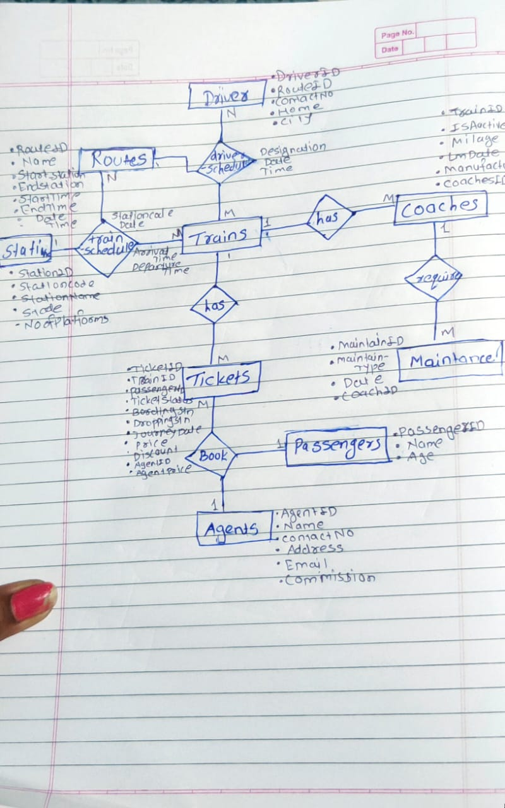

# DBMS Assignment

# 
INTERCITY EXPRESS TRAINS

## Member Contributions
   - ### Nikita Pale
       * ER Diagram, Creation of Relational Schema, Relations from ER diagram.
  - ### Vilas Jadhav
      *  Data Collection and Organization, Insertion of data into tables.
 
## Entity Relationship Diagram

