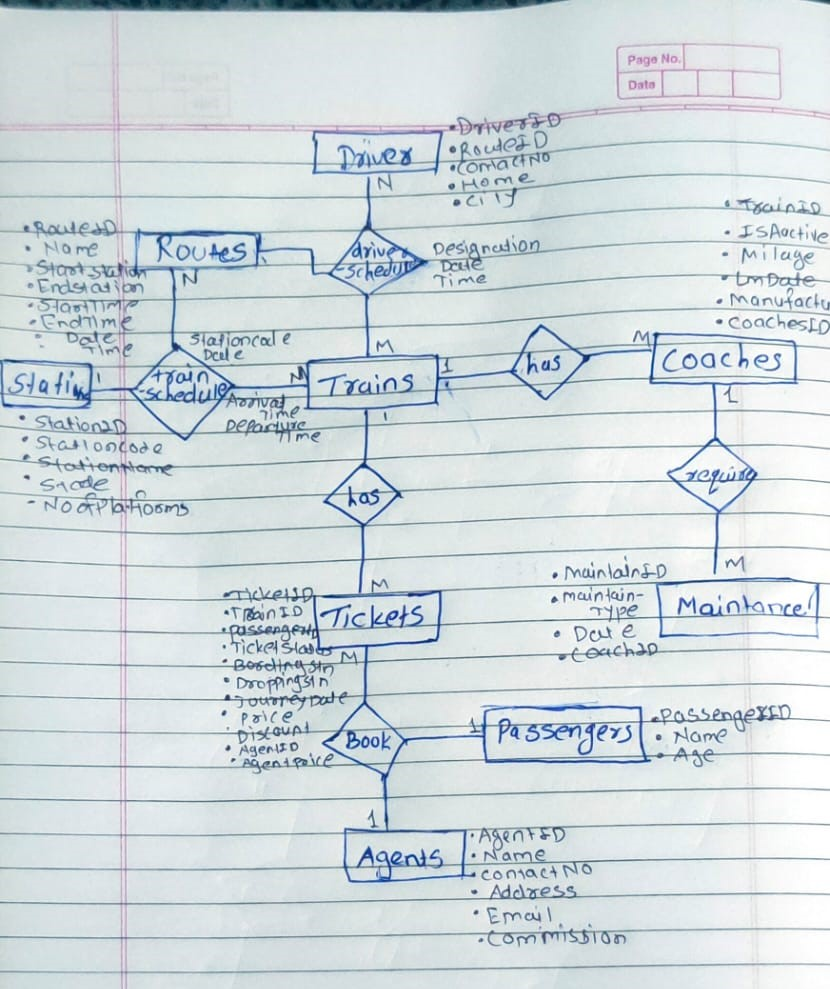

# DBMS Assignment

# <center>INTERCITY EXPRESS TRAINS</center>

## Member Contributions
   - ### 22111042 - Nikita Pale
       * ER Diagram, Creation of Relational Schema, Relations from ER diagram.
  - ### 22111075 - Vilas Jadhav
      *  Data Collection and Organization, Insertion of data into tables.

# Part 1

## Entity Relationship Diagram

<hr>


## Relations
Agents(AgentID,Name,ContactNo,Address,Email,Commission)

Coaches(CoachID,Manufacturer,LmDate,Milage,IsActive,TrainID)

Driver(DriverID,Name,ContactNo,Home,City)

DriverSchedule(TrainID,RouteID,DriverID,Designation,Date,Time)

Maintanance(MaintainID,MaintainType,Date,CoachID)

Passengers(PassengerID,Name,Age)

Routes(RouteID,Name,Start_station,End_station,Sart_time,End_time,Distance,TotalTime)

Stations(StationID,StationCode,StationName,State,NoOFPlatforms)

Tickets(TicketID,TrainID,PassengerID,TicketStatus,BoardingStn,DroppingStn,JourneyDate,BookingDate,Price,Discount,AgentID,AgentCommPrice)

Trains(TrainID,RouteID,TrainName)

TrainSchedule(TrainID,RouteID,StationCode,Date,EarlyArriveTime,ArriveTime,EarlyDepatTime,DepartTime)

## Database and Table creation

```sql
CREATE DATABASE intercity_db;
```

```sql
CREATE TABLE Passengers(
PassengerID VARCHAR(10) PRIMARY KEY,
Name VARCHAR(50),
Age INT
);
```

```sql
CREATE TABLE Agents(
AgentID VARCHAR(10) PRIMARY KEY,
Name VARCHAR(50),
ContactNO VARCHAR(15),
Address VARCHAR(100),
Email VARCHAR(70),
Commision DECIMAL(5,2)
);
```

```sql
CREATE TABLE Routes(
RouteID VARCHAR(10) PRIMARY KEY,
Name VARCHAR(50),
Distance INT,
Start_Station VARCHAR(10),
End_station VARCHAR(10),
Start_time TIME,
End_time TIME
Distance INT,
TotalTime TIME
);
```

```sql
CREATE TABLE Stations(
StationID VARCHAR(10) PRIMARY KEY,
StationCode VARCHAR(10) ,
StationName VARCHAR(50),
State VARCHAR(50),
NoOfPlatforms INT
);
```

```sql
CREATE TABLE Trains(
TrainID INT PRIMARY KEY,
TrainName VARCHAR(50),
RouteID VARCHAR(10),
FOREIGN KEY (RouteID) REFERENCES Routes(RouteID)
);
```

```sql
CREATE TABLE Coaches(
CoachID VARCHAR(10) PRIMARY KEY,
Manufacturer VARCHAR(100),
LmDate DATE,
Milage INT,
IsActive BOOLEAN
TrainID INT,
FOREIGN KEY (TrainID) REFERENCES Trains(TrainID)
);
```

```sql
CREATE TABLE Maintance(
MaintainID VARCHAR(10) PRIMARY KEY,
MaintainType VARCHAR(50),
Date Date,
CoachID VARCHAR(10),
FOREIGN KEY (CoachID) REFERENCES Coaches(CoachID)
);
```

```sql
CREATE TABLE TrainSchedule(
TrainID INT,
RouteID VARCHAR(10),
StationCode VARCHAR(10),
Date Date,
EarlyArrivTime TIME,
ArrivTime Time,
EarlyDepartTime TIME,
DepartTime TIME,
FOREIGN KEY(TrainID) REFERENCES Trains(TrainID),
FOREIGN KEY(RouteID) REFERENCES Routes(RouteID),
PRIMARY KEY(TrainID,RouteID)
);
```

```sql
Create Table Driver(
DriverID VARCHAR(10) PRIMARY KEY,
NAME VARCHAR(100),
ContactNo VARCHAR(20),
HomeCity VARCHAR(50)
);
```

```sql
CREATE TABLE DriverSchedule(
    TrainID INT,
    RouteID VARCHAR(10),
    DriverID VARCHAR(10),
    Designation VARCHAR(50),
    Date DATE,
    Time TIME,
    PRIMARY KEY(TrainID,RouteID,DriverID,Date,Time),
    FOREIGN KEY(TrainID) REFERENCES Trains(TrainID),
    FOREIGN KEY(RouteID) REFERENCES Routes(RouteID),
    FOREIGN KEY(DriverID) REFERENCES Driver(DriverID)
    );
```

```sql
CREATE TABLE Tickets(
TicaketID VARCHAR(10) PRIMARY KEY,
TrainID INT,
PassengerID VARCHAR(10),
TicketStatus VARCHAR(50),
BoardingStn VARCHAR(10),
DropingStn VARCHAR(10),
JourneyDate DATE,
BookingDate DATE,
Price INT,
Dicount INT,
AgentID VARCHAR(10),
AgentCommPrice INT,
PassengerType VARCHAR(20),
FOREIGN KEY(TrainID) REFERENCES Trains(TrainID),
FOREIGN KEY(PassengerID) REFERENCES Passengers(PassengerID),
FOREIGN KEY(AgentID) REFERENCES Agents(AgentID)
);
```

## Insert Statements

```sql
INSERT INTO Passengers (PassengerID, Name, Age) VALUES 
('P001', 'Suresh Patel', 31), 
('P002','Aditi Reddy', 65),  
('P003','Meera Das', 8), 
('P004','Anil Sharma', 59), 
('P005',Tanvi Singh', 26), 
('P006','Karan Verma', 70),
('P007','Divya Kapoor',40), 
('P008','Rohan Reddy', 28),
('P009','Pooja Patel', 62),
('P0010','Arjun Das', 30),
('P0011','Ria Sharma', 17),
('P0012','Sameer Singh', 45),
('P0013','Ayesha Verma', 55),
('P0014','Viren Kapoor', 68),
('P0015','Ritu Reddy', 26),
('P0016','Anu Singh', 10), 
('P0017','Ajay Mehta', 58), 
('P0018','Ajay Mehta', 58),
('P0019','Rahul Sharma', 70),
('P0020','Priyanka Singh', 31),
('P0021','Rakesh Verma', 65),
('P0022','Neha Patel', 8),
('P0023','Kavita Reddy', 27),
('P0024', 'Sanjay Singh', 40), 
('P0025','Ravi Verma', 32),
('P0026','Ananya Das', 30),
('P0027','Aryan Singh', 45),
('P0028','Neha Sharma', 22),
('P0029','Rajesh Kumar', 35), 
('P0030','Priya Patel', 28);
```

```sql
INSERT INTO Agents(AgentID , Name, Contactno, Address, Email, Commision) VALUES
('A001', 'Aarav Gupta', '1234567890','New Delhi', 'aarav@example.com',12),
('A002', 'Mira Patel','9876543210', 'Mumbai',  'mira@example.com',08),
('A003', 'Krish Sharma', '1112223333','Bengaluru',  'krish@example.com',09),
('A004', 'Ishaan Kumar', '4445556666','Chennai',  'ishaan@example.com',11),
('A005', 'Anaya Singh', '7778889999', 'Kolkata', 'anaya@example.com',10),
('A006', 'Diya Mishra', '9990001111','Hyderabad',  'diya@example.com',12),
('A007', 'Kabir Khan', '2223334444','Pune',  'kabir@example.com',08),
('A008', 'Riya Thakur', '5556667777','Jaipur',  'riya@example.com',09),
('A009', 'Aryan Choudhary','8889900000', 'Ahmedabad',  'aryan@example.com',12),
('A010', 'Avni Agarwal','6667788888', 'Kochi',  'avni@example.com',08),
('A011', 'Rehan Malhotra', '3334445555','Chandigarh',  'rehan@example.com',10),
('A012', 'Sia Verma','9001112222', 'Lucknow',  'sia@example.com',11),
('A013', 'Kabir Gupta', '1112223333','Goa',  'kabir@example.com',10),
('A014', 'Anika Rajput', '2223334444','Indore',  'anika@example.com',12),
('A015', 'Veer Singh','3334445555', 'Jaipur',  'veer@example.com',08);
```

```sql
INSERT INTO Stations(StationID, StationCode, StationName, NoOfPlatforms, State) VALUES
    ('ST001', 'PUNE', 'Pune', 6, 'MAHARASHTRA'),
    ('ST002', 'CSMT', 'MUMBAI', 12, 'MAHARASHTRA'),
    ('ST003', 'JAM', 'GANDHINAGAR', 10, 'GUJARAT'),
    ('ST004', 'ST', 'SURAT', 6, 'GUJARAT'),
    ('ST005', 'SINA', 'SRINAGAR', 7, 'JAMMU-KASHMIR'),
    ('ST006', 'SNSI', 'SAINAGAR SHIRDI TERMINUS', 6, 'MAHARASHTRA'),
    ('ST007', 'SUR', 'SOLAPUR', 5, 'MAHARASHTRA'),
    ('ST008', 'SOP', 'SHIVPUR', 3, 'MAHARASHTRA'),
    ('ST009', 'VSG', 'GOA', 8, 'GOA'),
    ('ST010', 'NDLS', 'NEW DELHI', 15, 'NEW DELHI'),
    ('ST011', 'UHL', 'UNA HIMACHAL', 7, 'HIMACHAL PRADESH'),
    ('ST012', 'LJN', 'LUCKNOW', 12, 'UTTAR PRADESH'),
    ('ST013', 'SC', 'SECUNDERABAD', 12, 'ANDHRA PRADESH'),
    ('ST014', 'VSKP', 'VISHAKHAPATNAM', 20, 'ANDHRA PRADESH'),
    ('ST015', 'BSB', 'VARANASI', 12, 'UTTAR PRADESH'),
    ('ST016', 'BPL', 'BHOPAL', 5, 'MADHYA PRADESH'),
    ('ST017', 'INDB', 'INDORE', 6, 'MADHYA PRADESH'),
    ('ST018', 'LNL', 'LONAVALA', 4, 'MAHARASHTRA'),
    ('ST019', 'AII', 'AJMER', 7, 'RAJASTHAN'),
    ('ST020', 'DWR', 'DHARWAD', 6, 'KARNATAKA'),
    ('ST021', 'SBC', 'BENGALURU', 20, 'KARNATAKA'),
    ('ST022', 'NGP', 'NAGPUR', 9, 'MAHARASHTRA'),
    ('ST023', 'MFP', 'MUZAFFARPUR', 8, 'BIHAR'),
    ('ST024', 'PNBE', 'PATNA', 10, 'BIHAR'),
    ('ST025', 'RXL', 'RAXAUL', 8, 'BIHAR'),
    ('ST026', 'BUI', 'BALLIA', 6, 'UTTAR PRADESH'),
    ('ST027', 'GKP', 'GORAKHPUR', 15, 'UTTAR PRADESH'),
    ('ST028', 'PRYJ', 'PRAYAGRAJ', 8, 'UTTAR PRADESH'),
    ('ST029', 'HWH', 'HOWRAH', 20, 'WEST BENGAL'),
    ('ST030', 'CNB', 'KANPUR', 11, 'UTTAR PRADESH'),
    ('ST031', 'BCT', 'Mumbai Central', 8, 'Maharashtra'),
    ('ST032', 'MAA', 'Chennai Central', 14, 'Tamil Nadu'),
    ('ST033', 'MAS', 'Chennai Terminus', 10, 'Tamil Nadu'),
    ('ST034', 'MMCT', 'Mumbai Central Terminus', 9, 'Maharashtra'),
    ('ST035', 'YPR', 'Yesvantpur Main', 7, 'Karnataka'),
    ('ST036', 'ADI', 'Ahmedabad Main', 9, 'Gujarat'),
    ('ST037', 'JP', 'Jaipur Main', 6, 'Rajasthan'),
    ('ST038', 'LTT', 'Lokmanya Tilak Main', 9, 'Maharashtra');
```

```sql
INSERT INTO Routes(RouteID, Name, TotalTime, Distance, Start_station, Start_time, End_station, End_time) VALUES
("RT001", "MUMBAI CENTRAL-GANDHINAGAR", '05:40:00', 548, "CSMT", '09:00:00', "JAM", '14:40:00'),
("RT014", "GANDHINAGAR-MUMBAI CENTRAL", '05:40:00', 548, "JAM", '16:40:00', "CSMT", '22:20:00'),
("RT002", "NEW DELHI-HIMACHAL", '06:10:00', 412, "NDLS", '07:00:00', "UHL", '13:10:00'),
("RT015", "HIMACHAL-NEW DELHI", '06:10:00', 412, "UHL", '16:10:00', "NDLS", '22:20:00'),
("RT003", "SECUNDERABAD-VISAKHAPATNAM", '08:30:00', 500, "SC", '10:00:00', "VSKP", '18:30:00'),
("RT016", "VISAKHAPATNAM-SECUNDERABAD", '08:30:00', 500, "VSKP", '21:30:00', "SC", '06:00:00'),
("RT004", "MUMBAI-SAINAGAR SHIRDI", '05:20:00', 248, "CSMT", '11:40:00', "SNSI", '05:00:00'),
("RT017", "SAINAGAR SHIRDI-MUMBAI", '05:20:00', 248, "SNSI", '07:00:00', "CSMT", '12:20:00'),
("RT005", "MUMBAI-SOLAPUR", '06:35:00', 400, "CSMT", '08:25:00', "SUR", '15:00:00'),
("RT018", "SOLAPUR-MUMBAI", '06:35:00', 400, "SUR", '17:00:00', "CSMT", '23:35:00'),
("RT006", "BHOPAL-DELHI", '07:45:00', 700, "BPL", '20:15:00', "NDLS", '04:00:00'),
("RT019", "DELHI-BHOPAL", '07:45:00', 700, "NDLS", '06:00:00', "BPL", '13:45:00'),
("RT007", "LONAVALA-AJMER", '10:45:00', 1062, "LNL", '02:15:00', "AII", '13:00:00'),
("RT020", "AJMER-LONAVALA", '10:45:00', 1062, "AII", '16:00:00', "LNL", '02:45:00'),
("RT008", "DHARWAD-BENGALURU", '05:00:00', 432, "DWR", '05:00:00', "SBC", '10:00:00'),
("RT021", "BENGALURU-DHARWAD", '05:00:00', 432, "SBC", '12:00:00', "DWR", '17:00:00'),
("RT009", "BHOPAL-INDORE", '03:00:00', 246, "BPL", '21:15:00', "INDB", '00:15:00'),
("RT022", "INDORE-BHOPAL", '03:00:00', 246, "INDB", '03:15:00', "BPL", '06:15:00'),
("RT010", "MUMBAI-GOA", '06:00:00', 588, "CSMT", '03:00:00', "VSG", '09:00:00'),
("RT023", "GOA-MUMBAI", '06:00:00', 588, "VSG", '12:15:00', "CSMT", '18:15:00'),
("RT011", "RAXAUL-HOWRAH", '17:50:00', 691, "RXL", '10:10:00', "HWH", '04:00:00'),
("RT024", "HOWRAH-RAXAUL", '17:50:00', 691, "HWH", '06:00:00', "RXL", '23:50:00');
```

```sql
INSERT INTO Trains(TrainID,TrainName,RouteID) values 
('22945','SAURASHTRA MAIL',"RT001"),
('14553','HIMACHAL EXPRESS',"RT002"),
('11019','KONARK EXPRESS',"RT003"),
('22223','SHIRDI VANDEBHARAT EXPRESS',"RT004"),
(11301,"UDYAN EXPRESS","RT005"),
(12715,"SACHKHAND EXPRESS","RT006"),
(19628,"AJMER SUPERFAST EXPRESS","RT007"),
(17325,"VISHWAMANAVA EXPRESS","RT008"),
(18234,"NARMADA EXPRESS","RT009"),
(10103,"MANDOVI EXPRESS","RT010"),
(13022,"MITHILA EXPRESS","RT011"),
('22946','SAURASHTRA MAIL',"RT014"),
('14552','HIMACHAL EXPRESS',"RT015"),
('11020','KONARK EXPRESS',"RT016"),
('22222','SHIRDI VANDEBHARAT EXPRESS',"RT017"),
(11302,"UDYAN EXPRESS","RT018"),
(12716,"SACHKHAND EXPRESS","RT019"),
(19627,"AJMER SUPERFAST EXPRESS","RT020"),
(17326,"VISHWAMANAVA EXPRESS","RT021"),
(18235,"NARMADA EXPRESS","RT022"),
(10102,"MANDOVI EXPRESS","RT023"),
(13021,"MITHILA EXPRESS","RT024");
```

```sql
INSERT INTO coaches (CoachID, Manufacturer, LmDate, Milage, IsActive,TrainID) VALUES
('CN001', 'XYZ Company', '2023-10-15', 5000, 1,10102),
('CN002', 'ABC Corporation', '2023-09-20', 3000, 1,10102),
('CN003', 'LMN Industries', '2023-11-05', 2000 , 1,10102),
('CN004', 'DEF Motors', '2023-08-12', 4500, 1,10102),
('CN005', 'PQR Ltd', '2023-10-30', 1000, 1,10102),
('CN006', 'UVW Inc', '2023-09-25', 3500, 1,10102),
('CN007', 'IJK Enterprises', '2023-11-10', 2500, 1,11301),
('CN008', 'OPQ Co', '2023-08-22', 4000, 1,11301),
('CN009', 'STU Corporation', '2023-10-05', 1500 , 1 ,11301),
('CN010', 'EFG Industries', '2023-11-15', 3500 , 1,11301),
('CN011', 'HIJ Motors', '2023-09-10', 4500, 1,11301),
('CN012', 'KLM Ltd', '2023-08-30', 2500, 1,11301),
('CN013', 'UVW Company', '2023-10-20', 500, 1,11019),
('CN014', 'RST Enterprises', '2023-11-25', 1000, 1,11019),
('CN015', 'ABC Motors', '2023-09-15', 3000, 1,11019),
('CN016', 'LMN Ltd', '2023-08-10', 2000, 1,11019),
('CN017', 'DEF Corporation', '2023-10-25', 4500, 1,11019),
('CN018', 'PQR Motors', '2023-09-05', 1000, 1,11019),
('CN019', 'XYZ Ltd', '2023-07-20', 5000, 1,12715),
('CN020', 'IJK Industries', '2023-11-05', 3000, 1,12715),
('CN021', 'OPQ Enterprises', '2023-10-30', 2500, 1,12715),
('CN022', 'EFG Co', '2023-09-25', 4000, 1,12715),
('CN023', 'HIJ Corporation', '2023-08-22', 1500, 1,12715),
('CN024', 'KLM Industries', '2023-11-10', 3500, 1,12715),
('CN025', 'STU Motors', '2023-10-05', 4500, 1,13021),
('CN026', 'RST Ltd', '2023-11-15', 2500, 1,,13021),
('CN027', 'UVW Enterprises', '2023-09-10', 500, 1,13021),
('CN028', 'ABC Co', '2023-08-30', 1000, 1,13021),
('CN029', 'LMN Corporation', '2023-10-20', 3000, 1,13021),
('CN030', 'DEF Industries', '2023-11-25', 2000, 1,13021),
('CN031', 'PQR Motors', '2023-09-15', 5000, 1,14552),
('CN032', 'XYZ Ltd', '2023-08-10', 3000, 1,14552),
('CN033', 'IJK Industries', '2023-10-25', 1500, 1,14552),
('CN034', 'OPQ Enterprises', '2023-09-05', 3500, 1,14552),
('CN035', 'EFG Co', '2023-07-20', 4500, 1,14552),
('CN036', 'HIJ Corporation', '2023-11-05', 2500, 1,14552),
('CN037', 'KLM Industries', '2023-10-30', 500, 1,17325),
('CN038', 'STU Motors', '2023-09-25', 1000, 1,17325),
('CN039', 'RST Ltd', '2023-08-22', 3000, 1,17325),
('CN040', 'UVW Enterprises', '2023-11-10', 2000, 1,17325),
('CN041', 'ABC Co', '2023-10-05', 5000, 1,17325),
('CN042', 'LMN Corporation', '2023-11-15', 3000,1, 17325),
('CN043', 'DEF Industries', '2023-09-10', 1500, 1, 18234)
('CN044', 'PQR Motors', '2023-08-30', 3500, 1, 18234),
('CN045', 'XYZ Ltd', '2023-10-20', 4500, 1, 18234),
('CN046', 'IJK Industries', '2023-11-25', 2500, 1, 18234),
('CN047', 'OPQ Enterprises', '2023-09-15', 500, 1, 18234),
('CN048', 'EFG Co', '2023-08-10', 1000, 1, 18234),
('CN049', 'HIJ Corporation', '2023-10-25', 3000, 1, 19627),
('CN050', 'KLM Industries', '2023-09-05', 2000, 1, 19627),
('CN051', 'STU Motors', '2023-07-20', 5000, 1, 19627),
('CN052', 'RST Ltd', '2023-11-15', 3000, 1, 19627),
('CN053', 'UVW Enterprises', '2023-10-30', 1500, 1, 19627),
('CN054', 'ABC Co', '2023-09-25', 4500, 1, 19627),
('CN055', 'LMN Corporation', '2023-08-22', 2500, 1, 22222),
('CN056', 'DEF Industries', '2023-11-10', 500, 1, 22222),
('CN057', 'PQR Motors', '2023-10-05', 1000, 1, 22222),
('CN058', 'XYZ Ltd', '2023-11-15', 3500, 1, 22222),
('CN059', 'IJK Industries', '2023-09-10', 4500, 1, 22222),
('CN060', 'OPQ Enterprises', '2023-08-30', 2000, 1, 22222),
('CN061', 'EFG Co', '2023-10-20', 3000, 1, 22945),
('CN062', 'HIJ Corporation', '2023-11-25', 500, 1, 22945),
('CN063', 'KLM Industries', '2023-09-15', 1500, 1, 22945),
('CN064', 'STU Motors', '2023-08-10', 4500, 1, 22945),
('CN065', 'RST Ltd', '2023-10-25', 2500, 1, 22945),
('CN066', 'UVW Enterprises', '2023-09-05', 5000, 1, 22945),
('CN067', 'ABC Co', '2023-07-20', 3000, 0, NULL),
('CN068', 'LMN Corporation', '2023-11-05', 1000, 0, NULL),
('CN069', 'DEF Industries', '2023-10-30', 3500, 0, NULL),
('CN070', 'PQR Motors', '2023-09-25', 2000, 0, NULL),
('CN071', 'XYZ Ltd', '2023-08-22', 5000, 0, NULL),
('CN072', 'IJK Industries', '2023-11-10', 3000, 0, NULL),
('CN073', 'OPQ Enterprises', '2023-10-05', 1500, 0, NULL),
('CN074', 'EFG Co', '2023-11-15', 4000, 0, NULL),
('CN075', 'HIJ Corporation', '2023-09-10', 500, 0, NULL),
('CN076', 'KLM Industries', '2023-08-30', 2500, 0, NULL),
('CN077', 'STU Motors', '2023-10-20', 1000, 0, NULL),
('CN078', 'RST Ltd', '2023-11-25', 3000, 0, NULL),
('CN079', 'UVW Enterprises', '2023-09-15', 2000, 0, NULL),
('CN080', 'ABC Co', '2023-08-10', 5000, 0, NULL),
('CN081', 'LMN Corporation', '2023-10-25', 3500, 0, NULL),
('CN082', 'DEF Industries', '2023-09-05', 1500, 0, NULL),
('CN083', 'PQR Motors', '2023-07-20', 4000, 0, NULL),
('CN084', 'XYZ Ltd', '2023-11-05', 500, 0, NULL),
('CN085', 'IJK Industries', '2023-10-30', 2500, 0, NULL),
('CN086', 'OPQ Enterprises', '2023-09-25', 3000, 0, NULL),
('CN087', 'EFG Co', '2023-08-22', 1000, 0, NULL),
('CN088', 'HIJ Corporation', '2023-11-10', 5000, 0, NULL),
('CN089', 'KLM Industries', '2023-10-05', 3000, 0, NULL),
('CN090', 'STU Motors', '2023-11-15', 2000, 0, NULL),
('CN091', 'RST Ltd', '2023-08-30', 4500, 0, NULL),
('CN092', 'UVW Enterprises', '2023-10-20', 1500, 0, NULL),
('CN093', 'ABC Co', '2023-11-25', 5000, 0, NULL),
('CN094', 'LMN Corporation', '2023-09-15', 3500, 0, NULL),
('CN095', 'DEF Industries', '2023-08-10', 500, 0, NULL),
('CN096', 'PQR Motors', '2023-10-25', 2500, 0, NULL),
('CN097', 'XYZ Ltd', '2023-09-05', 3000, 0, NULL),
('CN098', 'IJK Industries', '2023-07-20', 1000, 0, NULL),
('CN099', 'OPQ Enterprises', '2023-11-05', 4500, 0, NULL),
('CN100', 'EFG Co', '2023-10-30', 3000, 0, NULL);
```

```sql
INSERT INTO Maintance (MaintainID, MaintainType, Date, CoachID) VALUES
("MNT001", "Mileage", "2023-10-15", "CN001"),
("MNT002", "Mileage", "2023-09-20", "CN002"),
("MNT003", "Mileage", "2023-11-05", "CN003"),
("MNT004", "Mileage", "2023-08-12", "CN004"),
("MNT005", "Mileage", "2023-10-30", "CN005"),
("MNT006", "Mileage", "2023-05-23", "CN006"),
("MNT007", "Mileage", "2023-11-10", "CN007"),
("MNT008", "Mileage", "2023-08-22", "CN008"),
("MNT009", "Mileage", "2023-10-05", "CN009"),
("MNT010", "Mileage", "2023-11-15", "CN010"),
("MNT011", "Mileage", "2023-09-10", "CN011"),
("MNT012", "Mileage", "2023-08-30", "CN012"),
("MNT013", "Mileage", "2023-10-20", "CN013"),
("MNT014", "Mileage", "2023-11-25", "CN014"),
("MNT015", "Mileage", "2023-09-15", "CN015"),
("MNT016", "Mileage", "2023-08-10", "CN016"),
("MNT017", "Mileage", "2023-10-25", "CN017"),
("MNT018", "Mileage", "2023-09-05", "CN018"),
("MNT019", "Mileage", "2023-07-20", "CN019"),
("MNT020", "Mileage", "2023-11-05", "CN020"),
("MNT021", "Mileage", "2023-10-30", "CN021"),
("MNT022", "Mileage", "2023-09-25", "CN022"),
("MNT023", "Mileage", "2023-08-22", "CN023"),
("MNT024", "Mileage", "2023-11-10", "CN024"),
("MNT025", "Mileage", "2023-10-05", "CN025"),
("MNT026", "Mileage", "2023-11-15", "CN026"),
("MNT027", "Mileage", "2023-09-10", "CN027"),
("MNT028", "Mileage", "2023-08-30", "CN028"),
("MNT029", "Mileage", "2023-10-20", "CN029"),
("MNT030", "Mileage", "2023-11-25", "CN030"),
("MNT031", "Mileage", "2023-09-15", "CN031"),
("MNT032", "Mileage", "2023-08-10", "CN032"),
("MNT033", "Mileage", "2023-10-25", "CN033"),
("MNT034", "Mileage", "2023-09-05", "CN034"),
("MNT035", "Mileage", "2023-07-20", "CN035"),
("MNT036", "Mileage", "2023-11-05", "CN036"),
("MNT037", "Mileage", "2023-10-30", "CN037"),
("MNT038", "Mileage", "2023-09-25", "CN038"),
("MNT039", "Mileage", "2023-08-22", "CN039"),
("MNT040", "Mileage", "2023-11-10", "CN040"),
("MNT041", "Mileage", "2023-10-05", "CN041"),
("MNT042", "Mileage", "2023-11-15", "CN042"),
("MNT043", "Mileage", "2023-09-10", "CN043"),
("MNT044", "Mileage", "2023-08-30", "CN044"),
("MNT045", "Mileage", "2023-10-20", "CN045"),
("MNT046", "Mileage", "2023-11-25", "CN046"),
("MNT047", "Mileage", "2023-09-15", "CN047"),
("MNT048", "Mileage", "2023-08-10", "CN048"),
("MNT049", "Mileage", "2023-10-25", "CN049"),
("MNT050", "Mileage", "2023-09-05", "CN050"),
("MNT051", "Mileage", "2023-07-20", "CN051"),
("MNT052", "Mileage", "2023-11-05", "CN052"),
("MNT053", "Mileage", "2023-10-30", "CN053"),
("MNT054", "Mileage", "2023-09-25", "CN054"),
("MNT055", "Mileage", "2023-08-22", "CN055"),
("MNT056", "Mileage", "2023-11-10", "CN056"),
("MNT057", "Mileage", "2023-10-05", "CN057"),
("MNT058", "Mileage", "2023-11-15", "CN058"),
("MNT059", "Mileage", "2023-09-10", "CN059"),
("MNT060", "Mileage", "2023-08-30", "CN060"),
("MNT061", "Mileage", "2023-10-20", "CN061"),
("MNT062", "Mileage", "2023-11-25", "CN062"),
("MNT063", "Mileage", "2023-09-15", "CN063"),
("MNT064", "Mileage", "2023-08-10", "CN064"),
("MNT065", "Mileage", "2023-10-25", "CN065"),
("MNT066", "Mileage", "2023-09-05", "CN066"),
("MNT067", "Mileage", "2023-07-20", "CN067"),
("MNT068", "Mileage", "2023-11-05", "CN068"),
("MNT069", "Mileage", "2023-10-30", "CN069"),
("MNT070", "Mileage", "2023-09-25", "CN070"),
("MNT071", "Mileage", "2023-08-22", "CN071"),
("MNT072", "Mileage", "2023-11-10", "CN072"),
("MNT073", "Mileage", "2023-10-05", "CN073"),
("MNT074", "Mileage", "2023-11-15", "CN074"),
("MNT075", "Mileage", "2023-09-10", "CN075"),
("MNT076", "Mileage", "2023-08-30", "CN076"),
("MNT077", "Mileage", "2023-10-20", "CN077"),
("MNT078", "Mileage", "2023-11-25", "CN078"),
("MNT079", "Mileage", "2023-09-15", "CN079"),
("MNT080", "Mileage", "2023-08-10", "CN080"),
("MNT081", "Mileage", "2023-10-25", "CN081"),
("MNT082", "Mileage", "2023-09-05", "CN082"),
("MNT083", "Mileage", "2023-07-20", "CN083"),
("MNT084", "Mileage", "2023-11-05", "CN084"),
("MNT085", "Mileage", "2023-10-30", "CN085"),
("MNT086", "Mileage", "2023-09-25", "CN086"),
("MNT087", "Mileage", "2023-08-22", "CN087"),
("MNT088", "Mileage", "2023-11-10", "CN088"),
("MNT089", "Mileage", "2023-10-05", "CN089"),
("MNT090", "Mileage", "2023-11-15", "CN090"),
("MNT091", "Mileage", "2023-08-30", "CN091"),
("MNT092", "Mileage", "2023-10-20", "CN092"),
("MNT093", "Mileage", "2023-11-25", "CN093"),
("MNT094", "Mileage", "2023-09-15", "CN094"),
("MNT095", "Mileage", "2023-08-10", "CN095"),
("MNT096", "Mileage", "2023-10-25", "CN096"),
("MNT097", "Mileage", "2023-09-05", "CN097"),
("MNT098", "Mileage", "2023-07-20", "CN098"),
("MNT099", "Mileage", "2023-11-05", "CN099"),
("MNT100", "Mileage", "2023-10-30", "CN100");
```

```sql
INSERT INTO TrainSchedule(RouteID,TrainID,StationCode,Date,EarlyArrivTime,ArrivTime,EarlyDepartTime,DepartTime) values
('RT001',22945,'CSMT','2023-10-14',NULL,NULL,'09:00:00','09:00:00'),
('RT001',22945,'JAM','2023-10-14','14:40:00','14:52:00',NULL,NULL),
('RT014',22946,'JAM','2023-10-14',NULL,NULL,'16:40:00','16:40:00'),
('RT014',22946,'CSMT','2023-10-14','22:20:00','22:20:00',NULL,NULL),
('RT001',22945,'CSMT','2023-10-10',NULL,NULL,'09:00:00','09:00:00'),
('RT001',22945,'JAM','2023-10-10','14:40:00','14:52:00',NULL,NULL),
('RT014',22946,'JAM','2023-10-10',NULL,NULL,'16:40:00','16:40:00'),
('RT014',22946,'CSMT','2023-10-10','22:20:00','22:20:00',NULL,NULL),
('RT001',22945,'CSMT','2023-10-12',NULL,NULL,'09:00:00','09:00:00'),
('RT001',22945,'JAM','2023-10-12','14:40:00','14:40:00',NULL,NULL),
('RT014',22946,'JAM','2023-10-12',NULL,NULL,'16:40:00','16:40:00'),
('RT014',22946,'CSMT','2023-10-12','22:20:00','22:20:00',NULL,NULL),
('RT002',14553,'NDLS','2023-12-25',NULL,NULL,'07:00:00','07:00:00'),
('RT002',14553,'UHL','2023-12-25','13:10:00','13:10:00',NULL,NULL),
('RT015',14552,'UHL','2023-12-25',NULL,NULL,'16:10:00','16:10:00'),
('RT015',14552,'NDLS','2023-12-25','22:20:00','22:20:00',NULL,NULL),
('RT003',11019,'SC','2023-12-28',NULL,NULL,'10:00:00','10:00:00'),
('RT003',11019,'VSKP','2023-12-28','18:30:00','18:30:00',NULL,NULL),
('RT016',11020,'VSKP','2023-12-28',NULL,NULL,'21:30:00','21:30:00'),
('RT016',11020,'SC','2024-12-29','00:20:00','00:20:00',NULL,NULL),
('RT004',22223,'CSMT','2024-01-03',NULL,NULL,'11:40:00','11:40:00'),
('RT004',22223,'SNSI','2024-01-03','17:00:00','17:00:00',NULL,NULL),
('RT017',22222,'SNSI','2024-01-03',NULL,NULL,'19:00:00','19:00:00'),
('RT017',22222,'CSMT','2024-01-04','00:20:00','00:20:00',NULL,NULL),
('RT005',11301,'CSMT','2024-01-15',NULL,NULL,'08:25:00','08:25:00'),
('RT005',11301,'SUR','2024-01-15','15:00:00','15:00:00',NULL,NULL),
('RT018',11302,'SUR','2024-01-15',NULL,NULL,'17:00:00','17:00:00'),
('RT018',11302,'CSMT','2024-01-15','23:35:00','23:35:00',NULL,NULL),
('RT006',12715,'BPL','2024-01-25',NULL,NULL,'20:15:00','20:15:00'),
('RT006',12715,'NDLS','2024-01-26','04:00:00','04:00:00',NULL,NULL),
('RT019',12716,'NDLS','2024-01-26',NULL,NULL,'06:00:00','06:00:00'),
('RT019',12716,'BPL','2024-01-26','13:45:00','13:45:00',NULL,NULL),
('RT007',19628,'LNL','2024-02-05',NULL,NULL,'02:15:00','02:15:00'),
('RT007',19628,'AII','2024-02-05','13:00:00','13:00:00',NULL,NULL),
('RT020',19627,'AII','2024-02-05',NULL,NULL,'16:00:00','16:00:00'),
('RT020',19627,'LNL','2024-02-06','02:45:00','02:45:00',NULL,NULL),
('RT008',17325,'DWR','2024-02-15',NULL,NULL,'05:00:00','05:00:00'),
('RT008',17325,'SBC','2024-02-15','10:00:00','10:00:00',NULL,NULL),
('RT021',17326,'SBC','2024-02-15',NULL,NULL,'12:00:00','12:00:00'),
('RT021',17326,'DWR','2024-02-15','17:00:00','17:00:00',NULL,NULL),
('RT009',18234,'BPL','2024-02-25',NULL,NULL,'21:15:00','21:15:00'),
('RT009',18234,'INDB','2024-02-26','00:15:00','00:15:00',NULL,NULL),
('RT022',18235,'INDB','2024-02-26',NULL,NULL,'03:15:00','03:15:00'),
('RT022',18235,'BPL','2024-02-26','06:15:00','06:15:00',NULL,NULL),
('RT010',10103,'CSMT','2024-03-05',NULL,NULL,'03:00:00','03:00:00'),
('RT010',10103,'VSG','2024-03-05','09:00:00','09:00:00',NULL,NULL),
('RT023',10102,'VSG','2024-03-05',NULL,NULL,'12:15:00','12:15:00'),
('RT023',10102,'CSMT','2024-03-05','18:15:00','18:15:00',NULL,NULL),
('RT011',13022,'RXL','2024-03-15',NULL,NULL,'10:10:00','10:10:00'),
('RT011',13022,'HWH','2024-03-16','04:00:00','04:00:00',NULL,NULL),
('RT024',13021,'HWH','2024-03-16',NULL,NULL,'06:00:00','06:00:00'),
('RT024',13021,'RXL','2024-03-16','23:50:00','23:50:00',NULL,NULL);
```

```sql
INSERT INTO Driver (DriverID, NAME, ContactNo, HomeCity) VALUES
('S001', 'Rahul Sharma', '+91 12345 67890', 'Delhi'),
('S002', 'Priya Singh', '+91 98765 43210', 'Mumbai'),
('S003', 'Ajay Verma', '+91 11122 23333', 'Bengaluru'),
('S004', 'Anjali Khanna', '+91 44455 56666', 'Chennai'),
('S005', 'Vikram Patel', '+91 77788 89999', 'Kolkata'),
('S006', 'Neha Gupta', '+91 99900 01111', 'Hyderabad'),
('S007', 'Raj Malhotra', '+91 22233 34444', 'Pune'),
('S008', 'Kavita Tiwari', '+91 55566 67777', 'Jaipur'),
('S009', 'Arjun Reddy', '+91 88899 00000', 'Ahmedabad'),
('S010', 'Mahima Desai', '+91 66677 88888', 'Kochi'),
('S011', 'Prateek Mehta', '+91 33344 45555', 'Chandigarh'),
('S012', 'Swati Sharma', '+91 00011 12222', 'Lucknow'),
('S013', 'Rahul Kumar', '+91 11122 23333', 'Goa'),
('S014', 'Kriti Verma', '+91 22233 34444', 'Indore'),
('S015', 'Rohit Singh', '+91 33344 45555', 'Jaipur'),
('S016', 'Manisha Reddy', '+91 99999 88888', 'Hyderabad'),
('S017', 'Neeraj Bhatia', '+91 77777 66666', 'Mumbai'),
('S018', 'Meera Sharma', '+91 55555 44444', 'Delhi'),
('S019', 'Vinay Kapoor', '+91 33333 22222', 'Bengaluru'),
('S020', 'Pooja Singh', '+91 11111 00000', 'Kolkata'),
('S021', 'Suresh Patel', '+91 88888 99999', 'Chennai'),
('S022', 'Shikha Verma', '+91 66666 88888', 'Pune'),
('S023', 'Rohan Khanna', '+91 44444 77777', 'Jaipur'),
('S024', 'Divya Jain', '+91 22222 66666', 'Lucknow'),
('S025', 'Rajesh Agarwal', '+91 11111 55555', 'Goa'),
('S026', 'Ananya Das', '+91 99999 44444', 'Indore'),
('S027', 'Varun Malhotra', '+91 77777 33333', 'Jaipur'),
('S028', 'Asha Singh', '+91 55555 22222', 'Hyderabad'),
('S029', 'Ravi Patel', '+91 33333 11111', 'Mumbai'),
('S030', 'Priyanka Reddy', '+91 22222 00000', 'Delhi'),
('S031', 'Aditya Sinha', '+91 00000 99999', 'Bengaluru'),
('S032', 'Deepa Chawla', '+91 88888 88888', 'Kolkata'),
('S033', 'Vivek Kapoor', '+91 66666 77777', 'Chennai'),
('S034', 'Shivani Sharma', '+91 44444 66666', 'Pune'),
('S035', 'Nikhil Verma', '+91 22222 55555', 'Jaipur'),
('S036', 'Sweta Mehra', '+91 11111 44444', 'Lucknow'),
('S037', 'Aman Kumar', '+91 99999 33333', 'Goa'),
('S038', 'Megha Sen', '+91 77777 22222', 'Indore'),
('S039', 'Rohan Singh', '+91 55555 11111', 'Jaipur'),
('S040', 'Ashwini Reddy', '+91 33333 00000', 'Hyderabad'),
('S041', 'Kunal Sharma', '+91 22222 99999', 'Mumbai'),
('S042', 'Anjali Suri', '+91 11111 88888', 'Delhi'),
('S043', 'Vikas Malhotra', '+91 00000 77777', 'Bengaluru'),
('S044', 'Aditi Verma', '+91 88888 66666', 'Kolkata'),
('S045', 'Pranav Kapoor', '+91 66666 55555', 'Chennai'),
('S046', 'Simran Khanna', '+91 44444 44444', 'Pune'),
('S047', 'Arvind Singh', '+91 22222 33333', 'Jaipur'),
('S048', 'Anushka Tiwari', '+91 11111 22222', 'Lucknow'),
('S049', 'Rajat Kumar', '+91 99999 11111', 'Goa'),
('S050', 'Meghna Reddy', '+91 77777 00000', 'Indore'),
('S051', 'Sandeep Mehta', '+91 55555 99999', 'Jaipur'),
('S052', 'Ankita Sharma', '+91 33333 88888', 'Hyderabad'),
('S053', 'Alok Patel', '+91 22222 77777', 'Mumbai'),
('S054', 'Priya Jain', '+91 11111 66666', 'Delhi'),
('S055', 'Abhay Gupta', '+91 00000 55555', 'Bengaluru'),
('S056', 'Swati Singh', '+91 88888 44444', 'Kolkata'),
('S057', 'Rajiv Malhotra', '+91 66666 33333', 'Chennai'),
('S058', 'Ritika Verma', '+91 44444 22222', 'Pune'),
('S059', 'Kunal Bhatia', '+91 22222 11111', 'Jaipur'),
('S060', 'Shweta Reddy', '+91 11111 00000', 'Lucknow'),
('S061', 'Sarthak Singh', '+91 99999 99999', 'Goa'),
('S062', 'Harini Suri', '+91 77777 88888', 'Indore'),
('S063', 'Arnav Sharma', '+91 55555 77777', 'Jaipur'),
('S064', 'Anushka Sen', '+91 33333 66666', 'Hyderabad'),
('S065', 'Ram Kapoor', '+91 22222 55555', 'Mumbai'),
('S066', 'Leela Verma', '+91 11111 44444', 'Delhi'),
('S067', 'Kabir Singh', '+91 00000 33333', 'Bengaluru'),
('S068', 'Ritu Tiwari', '+91 88888 22222', 'Kolkata'),
('S069', 'Manoj Gupta', '+91 66666 11111', 'Chennai'),
('S070', 'Ashwini Sharma', '+91 44444 00000', 'Pune'),
('S071', 'Shreya Khanna', '+91 22222 99999', 'Jaipur'),
('S072', 'Soham Patel', '+91 11111 88888', 'Lucknow'),
('S073', 'Ankita Mehta', '+91 99999 77777', 'Goa'),
('S074', 'Vishal Singh', '+91 77777 66666', 'Indore'),
('S075', 'Neha Reddy', '+91 55555 55555', 'Jaipur'),
('S076', 'Rahul Kumar', '+91 33333 44444', 'Hyderabad'),
('S077', 'Sanjana Verma', '+91 22222 33333', 'Mumbai'),
('S078', 'Kartik Suri', '+91 11111 22222', 'Delhi'),
('S079', 'Nisha Malhotra', '+91 00000 11111', 'Bengaluru'),
('S080', 'Arjun Sinha', '+91 88888 00000', 'Kolkata'),
('S081', 'Aditi Bhatia', '+91 66666 99999', 'Chennai'),
('S082', 'Aman Sharma', '+91 44444 88888', 'Pune'),
('S083', 'Sakshi Kapoor', '+91 33333 77777', 'Jaipur'),
('S084', 'Abhay Mehra', '+91 22222 66666', 'Lucknow'),
('S085', 'Ananya Singh', '+91 11111 55555', 'Goa'),
('S086', 'Alok Malhotra', '+91 99999 44444', 'Indore'),
('S087', 'Manvi Reddy', '+91 77777 33333', 'Jaipur'),
('S088', 'Raghav Kumar', '+91 55555 22222', 'Hyderabad'),
('S089', 'Akanksha Mehta', '+91 44444 11111', 'Mumbai'),
('S090', 'Pranav Verma', '+91 33333 00000', 'Delhi'),
('S091', 'Simran Singh', '+91 22222 99999', 'Bengaluru'),
('S092', 'Sidharth Tiwari', '+91 11111 88888', 'Kolkata'),
('S093', 'Anika Patel', '+91 88888 77777', 'Chennai'),
('S094', 'Soham Sharma', '+91 66666 66666', 'Pune'),
('S095', 'Avni Singh', '+91 55555 55555', 'Jaipur'),
('S096', 'Kabir Reddy', '+91 44444 44444', 'Lucknow'),
('S097', 'Alisha Gupta', '+91 33333 33333', 'Goa'),
('S098', 'Aniket Malhotra', '+91 22222 22222', 'Indore'),
('S099', 'Tanvi Sinha', '+91 11111 11111', 'Jaipur'),
('S100', 'Arnav Sharma', '+91 99999 99999', 'Hyderabad');
```

```sql
INSERT INTO DriverSchedule(RouteID,TrainID,DriverID,Designation,Date,Time) values
('RT001',22945,'S001','MAIN DRIVER','2023-10-10','09:00:00'),
('RT001',22945,'S002','CO-DRIVER','2023-10-10','09:00:00'),
('RT014',22946,'S001','MAIN DRIVER','2023-10-10','16:40:00'),
('RT014',22946,'S002','CO-DRIVER','2023-10-10','16:40:00'),
('RT001',22945,'S001','MAIN DRIVER','2023-10-14','09:00:00'),
('RT001',22945,'S002','CO-DRIVER','2023-10-14','09:00:00'),
('RT014',22946,'S001','MAIN DRIVER','2023-10-14','16:40:00'),
('RT014',22946,'S002','CO-DRIVER','2023-10-14','16:40:00'),
('RT001',22945,'S001','MAIN DRIVER','2023-10-12','09:00:00'),
('RT001',22945,'S002','CO-DRIVER','2023-10-12','09:00:00'),
('RT014',22946,'S001','MAIN DRIVER','2023-10-12','16:40:00'),
('RT014',22946,'S002','CO-DRIVER','2023-10-12','16:40:00'),
('RT002',14553,'S003','MAIN DRIVER','2023-12-25','07:00:00'),
('RT002',14553,'S004','CO-DRIVER','2023-12-25','07:00:00'),
('RT015',14552,'S003','MAIN DRIVER','2023-12-25','16:10:00'),
('RT015',14552,'S004','CO-DRIVER','2023-12-25','16:10:00'),
('RT003',11019,'S005','MAIN DRIVER','2023-12-28','10:00:00'),
('RT003',11019,'S006','CO-DRIVER','2023-12-28','10:00:00'),
('RT016',11020,'S005','MAIN DRIVER','2023-12-28','21:30:00'),
('RT016',11020,'S006','CO-DRIVER','2023-12-28','21:30:00'),
('RT004',22223,'S007','MAIN DRIVER','2024-01-03','11:40:00'),
('RT004',22223,'S008','CO-DRIVER','2024-01-03','11:40:00'),
('RT017',22222,'S007','MAIN DRIVER','2024-01-03','19:00:00'),
('RT017',22222,'S008','CO-DRIVER','2024-01-03','19:00:00'),
('RT005',11301,'S009','MAIN DRIVER','2024-01-15','08:25:00'),
('RT005',11301,'S010','CO-DRIVER','2024-01-15','08:25:00'),
('RT018',11302,'S009','MAIN DRIVER','2024-01-15','17:00:00'),
('RT018',11302,'S010','CO-DRIVER','2024-01-15','17:00:00'),
('RT006',12715,'S011','MAIN DRIVER','2024-01-25','20:15:00'),
('RT006',12715,'S012','CO-DRIVER','2024-01-25','20:15:00'),
('RT019',12716,'S011','MAIN DRIVER','2024-01-26','06:00:00'),
('RT019',12716,'S012','CO-DRIVER','2024-01-26','06:00:00'),
('RT007',19628,'S013','MAIN DRIVER','2024-02-05','02:15:00'),
('RT007',19628,'S014','CO-DRIVER','2024-02-05','02:15:00'),
('RT020',19627,'S013','MAIN DRIVER','2024-02-05','16:00:00'),
('RT020',19627,'S014','CO-DRIVER','2024-02-05','16:00:00'),
('RT008',17325,'S015','MAIN DRIVER','2024-02-15','05:00:00'),
('RT008',17325,'S016','CO-DRIVER','2024-02-15','05:00:00'),
('RT021',17326,'S015','CO-DRIVER','2024-02-15','12:00:00'),
('RT021',17326,'S016','MAIN DRIVER','2024-02-15','12:00:00'),
('RT009',18234,'S017','MAIN DRIVER','2024-02-25','21:15:00'),
('RT009',18234,'S018','CO-DRIVER','2024-02-25','21:15:00'),
('RT022',18235,'S017','CO-DRIVER','2024-02-26','03:15:00'),
('RT022',18235,'S018','MAIN DRIVER','2024-02-26','03:15:00'),
('RT010',10103,'S019','MAIN DRIVER','2024-03-05','03:00:00'),
('RT010',10103,'S020','CO-DRIVER','2024-03-05','03:00:00'),
('RT023',10102,'S019','MAIN DRIVER','2024-03-05','12:15:00'),
('RT023',10102,'S020','CO-DRIVER','2024-03-05','12:15:00'),
('RT011',13022,'S021','MAIN DRIVER','2024-03-15','10:10:00'),
('RT011',13022,'S022','CO-DRIVER','2024-03-15','10:10:00'),
('RT024',13021,'S021','MAIN DRIVER','2024-03-16','06:00:00'),
('RT024',13021,'S022','CO-DRIVER','2024-03-16','06:00:00');
```

```sql
INSERT INTO Tickets (TicaketID, TrainID,PassengerID, TicketStatus, BoardingStn, DropingStn, JourneyDate, BookingDate, Price, Dicount, AgentID, AgentCommPrice, PassengerType)VALUES
('TKT001', 22945,'P030', 'confirmed',  'CSMT', 'JAM', '2023-12-15', '2023-11-01', 1200, 0, 'A001', 120, 'Adult'),
('TKT002', 22946,'P029', 'confirmed', 'JAM', 'CSMT', '2023-12-18', '2023-11-03', 1500, 0, 'A002', 150, 'Adult'),
('TKT003', 14552,'P028', 'pending',  'UHL', 'NDLS', '2023-12-20', '2023-11-15', 1100, 0, 'A003', 110, 'Adult'),
('TKT004', 14553,'P027', 'confirmed',  'NDLS', 'UHL', '2023-12-25', '2023-11-08', 1350, 0, 'A001', 135, 'Adult'),
('TKT005', 11019,'P026', 'confirmed', 'SC', 'VSKP', '2023-12-28', '2023-12-20', 1250, 0, 'A004', 125, 'Adult'),
('TKT006', 11020,'P025', 'confirmed',  'VSKP', 'SC', '2023-12-30', '2023-11-20', 1400, 0, 'A002', 140, 'Adult'),
('TKT007', 22223,'P024', 'pending',  'CSMT', 'SNSI', '2024-01-03', '2023-12-25', 1150, 0, NULL, NULL, 'Adult'),
('TKT008', 22222,'P023', 'confirmed',  'SNSI', 'CSMT', '2024-01-10', '2023-12-01', 1300, 0, 'A003', 130, 'Adult'),
('TKT009', 11301,'P022', 'confirmed', 'CSMT', 'SUR', '2024-01-15', '2023-12-05', 1550, 388, 'A004', 155, 'Children'),
('TKT010', 11302,'P021', 'confirmed',  'SUR', 'CSMT', '2024-01-20', '2023-12-10', 1650, 165, 'A001', 165, 'Senior Citizen'),
('TKT011', 12715,'P020', 'confirmed', 'BPL', 'NDLS', '2024-01-25', '2023-12-15', 1200, 0, 'A002', 120, 'Adult'),
('TKT012', 12716,'P019', 'pending',  'NDLS', 'BPL', '2024-02-01', '2023-12-20', 1250, 125, NULL, NULL, 'Senior Citizen'),
('TKT013', 19628,'P018', 'confirmed','LNL', 'AII', '2024-02-05', '2023-12-25', 1100, 275, 'A003', 110, 'Adult'),
('TKT014', 19627,'P017', 'confirmed',  'AII', 'LNL', '2024-02-10', '2024-01-01', 1450, 145, 'A004', 145, 'Adult'),
('TKT015', 17325,'P016', 'confirmed',  'DWR', 'SBC', '2024-02-15', '2024-01-05', 1300, 325, 'A001', 130, 'Children'),
('TKT016', 17326,'P015', 'pending',  'SBC', 'DWR', '2024-02-20', '2024-01-10', 1350, 0, NULL, NULL, 'Adult'),
('TKT017', 18234,'P014', 'confirmed',  'BPL', 'INDB', '2024-02-25', '2024-01-15', 140, 0 ,NULL, NULL, 'Senior Citizen'),
('TKT018', 18235, 'P013', 'confirmed', 'INDB', 'BPL', '2024-03-01', '2024-01-20', 1250, 125, 'A004', 125, 'Adult'),
('TKT019', 10103, 'P012', 'confirmed', 'CSMT', 'VSG', '2024-03-05', '2024-01-25', 1200, 120, 'A001', 120, 'Adult'),
('TKT020', 10102, 'P011', 'pending', 'VSG', 'CSMT', '2024-03-10', '2024-02-01', 1150, 287, NULL, NULL, 'Adult'),
('TKT021', 13022, 'P010', 'confirmed', 'RXL', 'HWH', '2024-03-15', '2024-01-05', 1300, 0, 'A003', 130, 'Adult'),
('TKT022', 13021, 'P009', 'confirmed', 'HWH', 'RXL', '2024-03-20', '2024-02-10', 1350, 135, 'A004', 135, 'Adult'),
('TKT023', 13021, 'P008', 'confirmed', 'HWH', 'RXL', '2024-03-25', '2024-02-15', 1400, 0, 'A001', 140, 'Adult'),
('TKT024', 14552, 'P007', 'pending', 'NDLS', 'UHL', '2024-03-30', '2024-02-20', 1450, 0, NULL, NULL, 'Adult'),
('TKT025', 19628, 'P006', 'confirmed', 'LNL', 'AII', '2024-04-01', '2024-02-25', 1200, 120, 'A003', 120, 'Senior Citizen'),
('TKT026', 12716, 'P005', 'confirmed', 'NDLS', 'BPL', '2024-04-05', '2024-03-01', 1250, 0, 'A004', 125, 'Adult'),
('TKT027', 13022, 'P004', 'confirmed', 'RXL', 'HWH', '2024-04-10', '2024-03-05', 1300, 130, 'A001', 130, 'Adult'),
('TKT028', 12715, 'P003', 'pending', 'BPL', 'NDLS', '2024-04-15', '2024-03-10', 1350, 338, NULL, NULL, 'Children'),
('TKT029', 13022, 'P002', 'confirmed', 'RXL', 'HWH', '2024-04-20', '2024-03-15', 1400, 140, 'A003', 140, 'Adult'),
('TKT030', 10102, 'P001', 'confirmed', 'VSG', 'CSMT', '2024-04-25', '2024-03-20', 1450, 0, 'A004', 145, 'Adult'),
('TKT031', 22945, 'P030', 'confirmed', 'CSMT', 'JAM', '2023-11-15', '2023-10-01', 1200, 0, 'A001', 120, 'Adult'),
('TKT032', 22946, 'P029', 'confirmed', 'JAM', 'CSMT', '2023-11-18', '2023-10-03', 1500, 0, 'A002', 150, 'Adult'),
('TKT033', 14552, 'P028', 'pending', 'UHL', 'NDLS', '2023-09-20', '2023-08-15', 1100, 0, 'A003', 110, 'Adult'),
('TKT034', 14553, 'P027', 'confirmed', 'NDLS', 'UHL', '2023-10-25', '2023-09-08', 1350, 0, 'A001', 135, 'Adult'),
('TKT035', 11019, 'P026', 'confirmed', 'SC', 'VSKP', '2023-10-28', '2023-09-20', 1250, 0, 'A004', 125, 'Adult'),
('TKT036', 11020, 'P025', 'confirmed', 'VSKP', 'SC', '2023-10-30', '2023-09-20', 1400, 0, 'A002', 140, 'Adult'),
('TKT037', 22223, 'P024', 'pending', 'CSMT', 'SNSI', '2023-12-03', '2023-11-25', 1150, 0, NULL, NULL, 'Adult'),
('TKT038', 22222, 'P023', 'confirmed', 'SNSI', 'CSMT', '2024-01-10', '2023-12-01', 1300, 0, 'A003', 130, 'Adult'),
('TKT039', 11301, 'P022', 'confirmed', 'CSMT', 'SUR', '2023-12-15', '2023-11-05', 1550, 388, 'A004', 155, 'Children'),
('TKT040', 11302, 'P021', 'confirmed', 'SUR', 'CSMT', '2024-01-20', '2023-12-10', 1650, 165, 'A001', 165, 'Senior Citizen'),
('TKT041', 12715, 'P020', 'confirmed', 'BPL', 'NDLS', '2023-12-25', '2023-11-15', 1200, 0, 'A002', 120, 'Adult'),
('TKT042', 12716, 'P019', 'pending', 'NDLS', 'BPL', '2024-01-01', '2023-11-20', 1250, 125, NULL, NULL, 'Senior Citizen'),
('TKT043', 19628, 'P018', 'confirmed', 'LNL', 'AII', '2023-12-05', '2023-11-25', 1100, 275, 'A003', 110, 'Adult'),
('TKT044', 19627, 'P017', 'confirmed', 'AII', 'LNL', '2024-01-10', '2023-12-01', 1450, 145, 'A004', 145, 'Adult'),
('TKT045', 17325, 'P016', 'confirmed', 'DWR', 'SBC','2024-01-15', '2023-12-05', 1300, 325, 'A001', 130, 'Children'),
('TKT046', 17326, 'P015', 'pending', 'SBC', 'DWR', '2024-01-20', '2023-12-10', 1350, 0, NULL, NULL, 'Adult'),
('TKT047', 18234, 'P014', 'confirmed', 'BPL', 'INDB', '2024-01-25', '2023-12-15', 1400, 140, 'A003', 140, 'Senior Citizen'),
('TKT048', 18235, 'P013', 'confirmed', 'INDB', 'BPL', '2024-02-01', '2023-12-20', 1250, 125, 'A004', 125, 'Adult'),
('TKT049', 10103, 'P012', 'confirmed', 'CSMT', 'VSG', '2024-02-05', '2023-12-25', 1200, 120, 'A001', 120, 'Adult'),
('TKT050', 10102, 'P012', 'pending', 'VSG', 'CSMT', '2024-02-10', '2024-01-01', 1150, 287, NULL, NULL, 'Adult'),
('TKT051', 13022, 'P010', 'confirmed', 'RXL', 'HWH', '2024-02-15', '2024-01-05', 1300, 0, 'A003', 130, 'Adult'),
('TKT052', 13021, 'P009', 'confirmed', 'HWH', 'RXL', '2024-02-20', '2024-01-10', 1350, 135, 'A004', 135, 'Adult'),
('TKT053', 13021, 'P008', 'confirmed', 'HWH', 'RXL', '2024-02-25', '2024-01-15', 1400, 0, 'A001', 140, 'Adult'),
('TKT054', 14552, 'P007', 'pending', 'NDLS', 'UHL', '2024-03-01', '2024-01-20', 1450, 0, NULL, NULL, 'Adult'),
('TKT055', 19628, 'P006', 'confirmed', 'LNL', 'AII', '2024-03-05', '2024-01-25', 1200, 120, 'A003', 120, 'Senior Citizen'),
('TKT056', 12716, 'P005', 'confirmed', 'NDLS', 'BPL', '2024-03-10', '2024-02-01', 1250, 0, 'A004', 125, 'Adult'),
('TKT057', 13022, 'P004', 'confirmed', 'RXL', 'HWH', '2024-03-15', '2024-02-05', 1300, 130, 'A001', 130, 'Adult'),
('TKT058', 12715, 'P003', 'pending', 'BPL', 'NDLS', '2024-03-20', '2024-02-10', 1350, 338, NULL, NULL, 'Children'),
('TKT059', 13022, 'P002', 'confirmed', 'RXL', 'HWH', '2024-03-25', '2024-02-15', 1400, 140, 'A003', 140, 'Adult'),
('TKT060', 10102, 'P001', 'confirmed', 'VSG', 'CSMT', '2024-03-30', '2024-02-20', 1450, 0, 'A004', 145, 'Adult');
```

# Part 2

[Nikita Pale - 22111042](https://github.com/nikitapale/dbms_assignment/blob/main/Nikita_22111042.md)

[Vilas Jadhav - 22111075](https://github.com/nikitapale/dbms_assignment/blob/main/Vilas_22111075.md)


