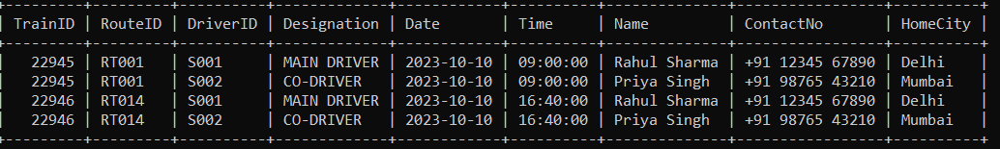
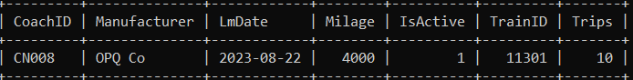
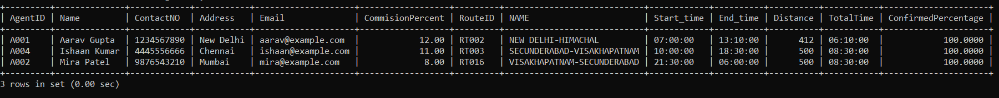
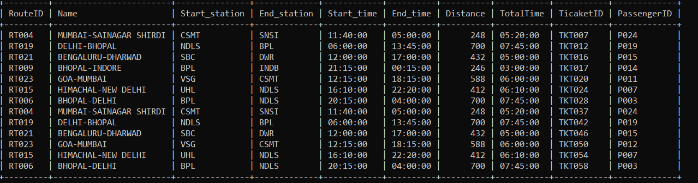
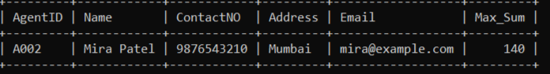

# Set - B
### 1.	Show schedule of all trips including main driver information for 10th October this year.

```sql
SELECT DS.*,D.Name,D.ContactNo, D.HomeCity
FROM DriverSchedule DS , Driver D
WHERE DS.DriverID = D.DriverID AND DS.Date = '2023-10-10';
```


<hr>

### 2.	List all coaches with mileage between 4000 and 4999 km covered for September this year; include information on the coach, its last service date and total number of scheduled trips.

```sql
select C.* , floor(C.milage/R.Distance) as Trips
 from Coaches C, Trains T, Routes R
 Where milage in(4000,4999)
 and month(C.LmDate)=8
 and C.TrainID = T.TrainID
 and T.RouteID = R.RouteID;
```


<hr>


### 3.	List all agents, in descending order of percentage of confirmed booking each trip in the month of October this year. Include agent and route information in your result.s year.

```sql
SELECT A.AgentID, A.Name, A.ContactNO, A.Address, A.Email, A.Commision AS CommisionPercent, R.RouteID, R.NAME, R.Start_time, R.End_time, R.Distance, R.TotalTime,
COUNT(CASE WHEN TK.TicketStatus='confirmed' THEN 1 ELSE NULL END) / COUNT(*) * 100 AS ConfirmedPercentage
FROM Agents A
INNER JOIN Tickets TK ON A.AgentID = TK.AgentID
INNER JOIN Trains T ON T.TrainID = TK.TrainID
INNER JOIN Routes R ON R.RouteID = T.RouteID
WHERE YEAR(TK.JourneyDate) = 2023 AND MONTH(TK.JourneyDate) = 10
GROUP BY A.AgentID, R.RouteID
ORDER BY ConfirmedPercentage DESC;
```


<hr>


### 4.	Display the details of the routes where majority of bookings are not made by agents.

```sql
SELECT R.*, TK.TicaketID, TK.PassengerID from Routes R
INNER JOIN Trains T ON R.RouteID = T.RouteID
INNER JOIN Tickets TK ON TK.TrainID = T.TrainID
WHERE TK.AgentID IS NULL;
```


<hr>


### 5.	Display the details of the agents who have made maximum commission in the Month of September.

```sql
SELECT AG.AgentID,AG.Name, AG.ContactNO, AG.Address, AG.Email, AG.sum as Max_Sum from
(SELECT TK.AgentID, A.Name, A.ContactNO, A.Address, A.Email, sum(TK.AgentCommPrice) AS sum FROM Tickets TK
   INNER JOIN Agents A ON TK.AgentID = A.AgentID
   WHERE TK.AgentID IS NOT NULL AND month(BookingDate)=9 GROUP BY TK.AgentID ORDER BY sum desc) AG limit 1;
```


<hr>
